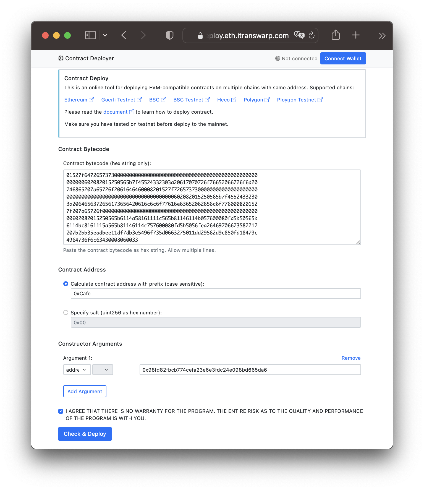

# Contract Deployer

This online service helps deploy EVM-compatible contract on multiple chains with same address.

Read the [document](doc.md) and [start deploy](https://deploy.eth.itranswarp.com).

### Screenshot

### Alternative

You can use alternative tools for calculating contract address. Use [Java version](https://github.com/michaelliao/contract-deployer/tree/master/alternative/java) is much faster.

### Reference

[如何在不同链部署地址完全相同的合约](https://www.liaoxuefeng.com/article/1430588932227106)
