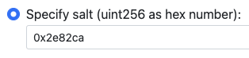

# Document

This online service helps deploy EVM-compatible contract on multiple chains with same address.

The deploy factory contract was already deployed on multiple chains with same address [0xEa5837...383B59](https://etherscan.io/address/0xEa5837e1F89e3cf23027dA7866e6492458383B59).

The deploy factory contract uses [CREATE2](https://docs.openzeppelin.com/cli/2.8/deploying-with-create2) opcode to deplopy a specific contract by pre-caculated address.

# How to Deploy

### Get Contract Bytecode

Compile your contracts in [Remix](http://remix.ethereum.org) or other tools. Here is an example of [CafeToken](CafeToken.sol).

A metadata file `CafeToken.json` can be found in Remix - File explorer - contracts - artifacts:

```
// CafeToken.json:
{
    "deploy": {
        ...
    },
    "data": {
        "bytecode": {
            ...
            "object": "6080604052604051...", <-- this is the bytecode for deployment as hex string
            ...
        },
        "deployedBytecode": {
            ...
            "object": "6080604052348015...", <-- this is NOT the bytecode for deployment
            ...
        },
        ...
    }
    ...
}
```

Use the bytecode for deployment but not the deployedBytecode. Lean [the difference between bytecode and deployed bytecode](https://medium.com/coinmonks/the-difference-between-bytecode-and-deployed-bytecode-64594db723df).


### Caculate the Address

Enter the prefix if you want a deployed address with prefix like `0xCafe`:


### Add Arguments

Add arguments to match the constructor of your contract:


### Deploy

Click `Check & Deploy` to start caculation and wait for several minutes (depends the length of the address prefix). Download the deployment summary for the future use, then click `Deploy` to launch MetaMask for transaction signature.


### Deploy on Next Chain

You can use the salt downloaded from the previous step for deployment without long-time caculation again:



# Important Nodes

Note the execution of the constructor of the deployed contract: the `msg.sender` is not the operator but the deploy-factory-contract address which is `0xEa5837...383B59`. Here is an example which logic is not correct:

```
import "@openzeppelin/contracts/access/Ownable.sol";

contract LostControlContract is Ownable {
    // owner is always set to 0xEa5837...383B59:
    constructor() {
    }
}
```

You must provide the owner address from constructor argument:

```
import "@openzeppelin/contracts/access/Ownable.sol";

contract HasControlContract is Ownable {
    constructor(address _owner) {
        transferOwnership(_owner);
    }
}
```
